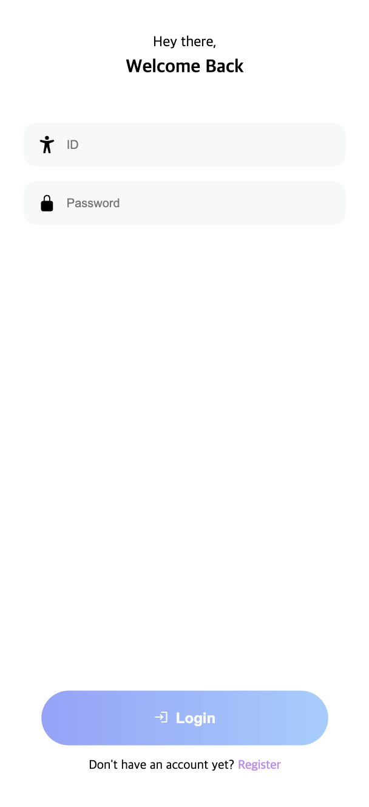
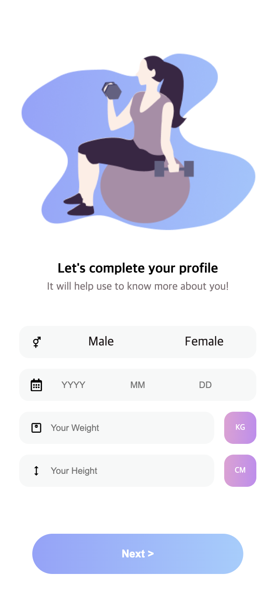
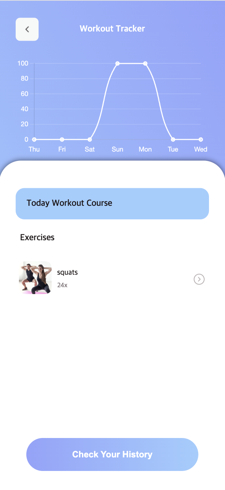
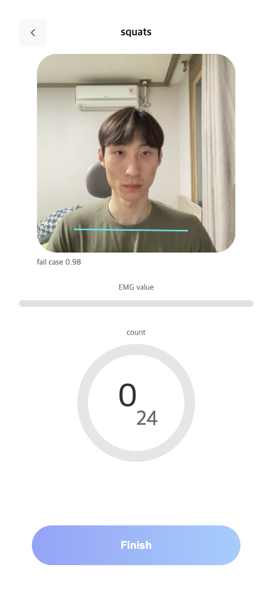
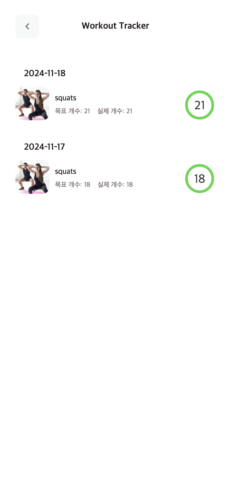

# Client-FitnestX

## 개요

FitnestX는 동작 인식 및 근전도(EMG) 센서를 활용한 스쿼트 보조 서비스입니다. 
사용자를 고려해 스쿼트 횟수를 추천하고, AI 기반 동작 인식 기술을 통해 올바른 자세와 근전도 데이터를 통해 적절한 근육 활성화를 확인하여 운동 효율성을 극대화합니다.

## 주요 기능

1. **스쿼트 자세 정확도 분석**: AI 동작 인식 기술로 올바른 자세를 실시간으로 확인.
2. **근육 활성화 측정**: EMG 센서를 통해 운동 부위가 적절히 사용되고 있는지 평가.
3. **운동 기록 관리**: 사용자의 운동 기록과 분석 결과를 시각화하여 제공.

## 시스템 구성

1. 클라이언트 (React 기반 웹 애플리케이션)
2. 서버 (Node.js 및 MySQL)
3. 하드웨어(Arduino Uno)

## 구현 기술

**동작 인식**: Google Teachable Machine을 이용해 특정 운동 모델을 학습하고 사용자 동작 분석. 
**근전도 데이터 처리**: 근전도 센서를 통해 실시간 데이터를 수집하고 정확도를 분석. 
**서버 관리**: Node.js 기반 서버 및 MySQL 데이터베이스를 사용해 운동 정보와 사용자 데이터를 처리. 

## 구현

 ||||
--- | --- | --- | --- | --- |
로그인|회원가입|목록|스쿼트|기록|

